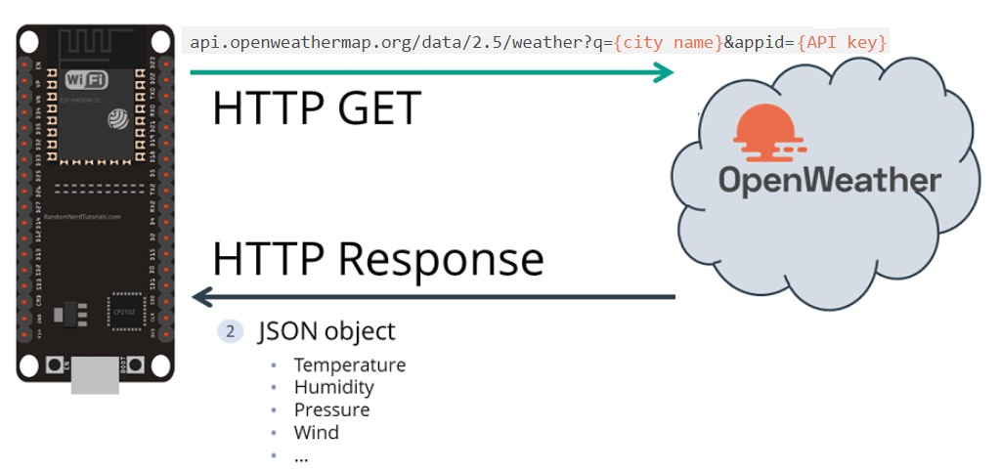

# ESP32_E_OPENWEATHERMAP
- Desenvolvimento de um Dispositivo IoT para requisição de dados de Previsão do Tempo ao Server OpenWeatherMap utilizando o microcontrolador ESP32.

## DISPOSITIVO IoT DE PREVISÃO DO TEMPO COM ESP32 E OPENWEATHERMAP

Os dados requisitados são exibidos no display TFT acompanhadas de algumas imagens bitmaps de ícones de previsão do tempo, de modo a otimizar a visualização ao usuário.

As imagens bitmaps são armazenadas num cartão SD, que esta inserido na placa do Display TFT.
  
## ESP-WROOM-32

Desenvolvido pela empresa Espressif, o ESP32 apresenta-se como um meio inovador no desenvolvimento de projetos automatizados. 

Esse pequeno componente demonstra ser mais versátil do que seu antecessor, o ESP8266, pois além do clássico módulo de comunicação Wi-Fi, apresenta um sistema com processador Dual Core, Bluetooth híbrido e múltiplos sensores embutidos, tornando a construção de sistema como internet das coisas (IoT) muito mais simples e compacto.

Ele possui dois Microprocessadores Xtensa® 32-bit LX6 com até 600 DMIPS (velocidade de processamento). 

A frequência do clock pode ser de até 240 MHz, dependendo do modelo. A frequência mais comum é 160 MHz (10 vezes o clock do Arduino Uno).

Características principais:
- Chip com WiFi embutido: padrão 802.11 B/G/N, operando na faixa de 2.4 a 2.5GHz
- Modos de operação: Client, Access Point, Station+Access Point
- Microprocessador dual core Tensilica Xtensa 32-bit LX6
- Clock ajustável de 80MHz até 240MHz
- Tensão de operação: 3.3 VDC
- Possui SRAM de 512KB
- Possui ROM de 448KB
- Possui memória flash externa de 32Mb (4 megabytes)
- Corrente máxima por pino é de 12mA (recomenda-se usar 6mA)
- Possui 36 GPIOs
- GPIOs com função PWM / I2C e SPI
- Possui Bluetooth v4.2 BR / EDR e BLE (Bluetooth Low Energy)

## OpenWeatherMap

OpenWeatherMap é um serviço online, de propriedade da OpenWeather Ltd, que fornece dados meteorológicos globais via API, incluindo dados meteorológicos atuais, previsões, previsões instantâneas e dados meteorológicos históricos para qualquer localização geográfica.

A empresa fornece uma previsão de precipitação hiperlocal minuto a minuto para qualquer local. O modelo de aprendizado de máquina convolucional é usado para utilizar serviços de transmissão meteorológica e dados de estações meteorológicas de aeroportos, estações de radar em solo, satélites meteorológicos, satélites de sensoriamento remoto, METAR e estações meteorológicas automatizadas.

A variedade de APIs meteorológicas fornecidas pelo OpenWeatherMap encontraram uma popularidade significativa entre os desenvolvedores de software, o que resultou na crescente multidão de repositórios no GitHub. As APIs oferecem suporte a vários idiomas, unidades de medida e formatos de dados padrão da indústria, como JSON e XML.

Em 2021, o OpenWeatherMap lançou uma série de iniciativas para apoiar estudantes, pesquisadores e desenvolvedores em todo o mundo.

<https://openweathermap.org/>

## - Objetivo

Programa desenvolvido em linguagem C++ para o microcontrolador ESP32 (ESP-WROOM-32) tem como objetivo a requisição de dados metereológicos com as seguintes APIS:

1)API Current weather data:

Será exibido os dados de Temperatura, Umidade, Pressão Atmosférica, Velocidade do Vento, direção do Vento, Preciptação, Informação do Clima atual, horário de Nascer do Sol e Pôr do Sol.

A)Exemplo JSON de resposta API:

{
  "coord": {
    "lon": -122.08,
    "lat": 37.39
  },
  "weather": [
    {
      "id": 800,
      "main": "Clear",
      "description": "clear sky",
      "icon": "01d"
    }
  ],
  "base": "stations",
  "main": {
    "temp": 282.55,
    "feels_like": 281.86,
    "temp_min": 280.37,
    "temp_max": 284.26,
    "pressure": 1023,
    "humidity": 100
  },
  "visibility": 16093,
  "wind": {
    "speed": 1.5,
    "deg": 350
  },
  "clouds": {
    "all": 1
  },
  "dt": 1560350645,
  "sys": {
    "type": 1,
    "id": 5122,
    "message": 0.0139,
    "country": "US",
    "sunrise": 1560343627,
    "sunset": 1560396563
  },
  "timezone": -25200,
  "id": 420006353,
  "name": "Mountain View",
  "cod": 200
  }  

<https://openweathermap.org/current>

2)One Call API: 

A API One Call fornece os seguintes dados meteorológicos para quaisquer coordenadas geográficas:

A)Current weather;
B)Minute forecast for 1 hour;
C)Hourly forecast for 48 hours;
D)Daily forecast for 7 days;
E)National weather alerts;
F)Historical weather data for the previous 5 days;

<https://openweathermap.org/api/one-call-api>

Estas API tem um plano gratuito e fornece muitas informações úteis sobre o clima em quase qualquer lugar do mundo.

Será exibido os dados de Temperatura Máxima do Dia e Informação do Clima para os próximos 4 dias contando da data atual.

### Screen Inicial do Display TFT:

Inicialmente foi o dispositivo IoT foi configurado para requisitar as informações metereológicas da cidade de: Sorocaba-SP (BRasil).

